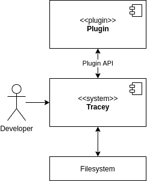

# System Scope and Context

Tracey collects data from the file system. This data is passed through a chain of plugins. In the end Tracey writes the updated data back to the file system.

## Developer

The developer is the user of the software. The developer configures Tracey and initiates its execution by calling the command line interface.

## Plugin

The collected data is passed through a chain of plugins. Each plugin receives the data as input, acts upon this data, and then returns the same shape. The output is then used for the next plugin in the chain until all plugins were executed.

## File system

All data is somewhere in the project files.
