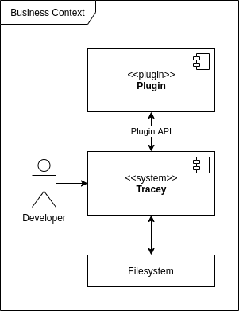
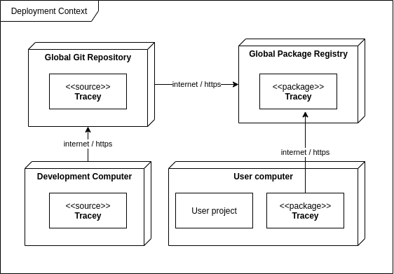

# Context

## Business Context

Tracey collects data from the file system.
This data is passed through a chain of plugins.
In the end Tracey writes the updated data back to the file system.

| Neighbor    | Description                                                   |
| ----------- | ------------------------------------------------------------- |
| Developer   | Uses Tracey on the command line to generate tracelinks        |
| File System | Requirements and annotations are located in the project files |
| Plugin      | Data is passed through a chain of plugins                     |

## Deployment Context

Tracey is developed locally and pushed to a global public git repository on [GitHub](https://github.com/konstantin-hatvan/traceability-tool). From there, a deployment pipeline is executed for building the package and publishing the package to the global public [npm](https://www.npmjs.com/package/tracey-cli) registry. Users can then install the package locally.

