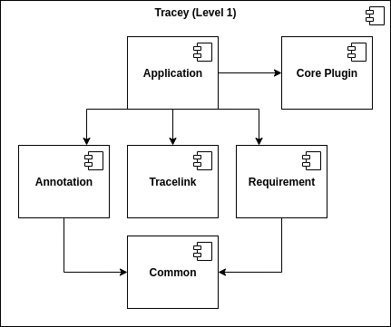
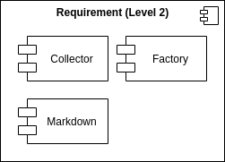
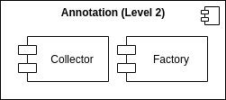
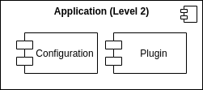
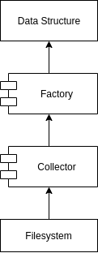

# Building Block View

On the top level we can see that Tracey consists of the components Common, Requirement, Annotation, Tracelink, Application and the Core Plugin. The components were separated using functional decomposition.

## Components

### Common

The Common component provides shared functionality and abstractions for other components.

### Requirement

The Requirement component is responsible for managing requirements.
It collects data from the file system and writes data back to the file system.
The component consists of the Collector, Factory and Markdown module.

### Annotation

The Annotation component is responsible for managing annotations.
It collects data from the file system.
The component consists of the Collector and Factory module.

### Tracelink

The Tracelink component is responsible for connecting requirements with their matching annotations.

### Application

The Application component is used to wire the application together.
It handles the configuration, uses the Requirement, Annotation and Tracelink component to collect or persist data and it manages the plugin API.
The component consists of the Configuration and the Plugin module.

## Pattern Language

The Collector and Factory modules describe shared patterns among the Requirement and Annotation component.

### Collector

> A Collector selects files for further processing

A Collector pattern describes a module that recursively walks the file system from a provided startingpoint.
Additionally, the Collector is given a set of conditions.
The Collector checks each file against all conditions.
The output is a list of all files found underneath the startingpoint that pass all conditions.

### Factory

> A Factory creates a data structure from a file

A Factory pattern describes a module that receives the output of a Collector pattern as input and transforms it to a data structure.
There are no additional rules on how to achieve that.
