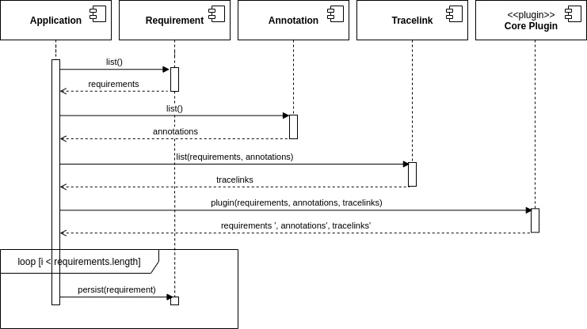
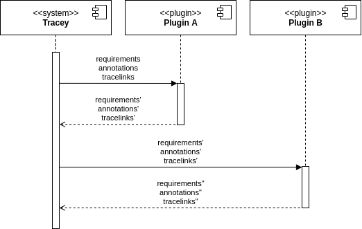

# Runtimte View

## Tracelink Generation

To generate tracelinks, Tracey uses the Core Plugin which is part of the system itself but uses the plugin API.
The Application component first calls the Requirement, Annotation and Tracelink component to collect data.
The data is then passed to the Core Plugin which manipulates the requirements.
The returned data is then persisted by using a loop on the Requirement component.

## Plugin API

Tracey can be configured to use a set of plugins.
Plugins have to conform to the plugin API.
The input has to be the same shape as the output.
The plugin receives the current state of requirements, annotations and tracelinks as input.
The plugin can perform any processing, transformation or analysis.
Tracey calls the plugins in order and sequentially.
