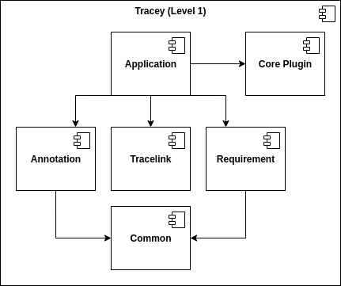
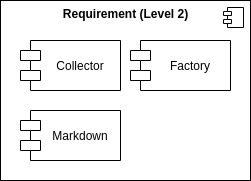
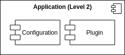
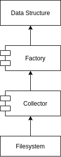
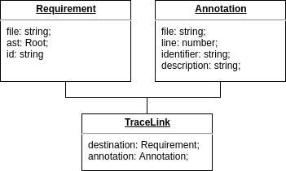

# Architecture Overview

Project Tracey is a markdown-based requirements tool. This document shall give an insight on crucial design decisions and explain core software elements. I use [arc42](https://arc42.de/) as a template.

## Table of Contents

1. [Introduction and Goals](#introduction-and-goals)
2. [Constraints](#constraints)
3. [Context](#context)
4. [Solution Strategy](#solution-strategy)
5. [Building Block View](#building-block-view)
6. [Runtime View](#runtime-view)
7. [Deployment View](#deployment-view)
8. [Cross Cutting Concepts](#cross-cutting-concepts)
9. [Quality Requirements](#quality-requirements)
10. [Risks and Technical Debts](#risks-and-technical-debts)

## Introduction and Goals

Tracey generates tracelinks between structured requirements and source code.

### Requirements Overview

| ID    | Requirement                                                                 |
| ----- | --------------------------------------------------------------------------- |
| REQ_1 | Project requirements are documented in markdown files                       |
| REQ_2 | Links between requirements and source code are documented using annotations |
| REQ_3 | Tracey generates tracelinks between requirements and source code artifacts  |

### Quality Goals

| ID   | Quality Goal            | Description                                                              |
| ---- | ----------------------- | ------------------------------------------------------------------------ |
| QG_1 | Lightweight             | Tracey uses a small set of rules and is easy to follow                   |
| QG_2 | Extensibility           | The core functionality can be extended                                   |
| QG_3 | Scientific Contribution | Tracey provides a contribution to the field of requirements traceability |
| QG_4 | Gradual Adoptability    | Tracey can easily be introduced into existing projects                   |

### Stakeholders

| Stakeholder            | Role                 | Interest                                              |
| ---------------------- | -------------------- | ----------------------------------------------------- |
| Konstantin Hatvan      | Student              | Successfully finish master's degree                   |
| Klaus Feiler           | Technical Supervisor | Improve development processes in the company          |
| Daniel Kienböck        | Academic Supervisor  | Ensure formal and academic requirements are fulfilled |

## Constraints

Tracey shall:

- have minimal dependencies (Node.js)
- be implemented in TypeScript
- be developed exclusively by Konstantin Hatvan
- be hosted on [GitHub](https://github.com/konstantin-hatvan/traceability-tool)
- be distributed using [npm](https://www.npmjs.com/package/tracey-cli)
- be developed starting in June 2020 and finishing in Januray 2021
- be executed from the command line
- run on Windows, Mac and Linux

## Context

Tracey collects data from the file system.
This data is passed through a chain of plugins.
In the end Tracey writes the updated data back to the file system.

| Neighbor    | Description                                                   |
| ----------- | ------------------------------------------------------------- |
| Developer   | Uses Tracey on the command line to generate tracelinks        |
| File System | Requirements and annotations are located in the project files |
| Plugin      | Data is passed through a chain of plugins                     |

## Solution Strategy

### Lightweight

Tracey has a small set of rules that are easy to learn and follow.
In short summary the rules are:

- Document the requirements in markdown files
- Assign each requirement a unique identifier in the frontmatter
- Use the frontmatter identifier in the source code annotations

This makes the system very easy to use and easy to learn.

### Extensibility

Tracey allows extension of the core functionality through plugins.
Plugins are functions and only follow a single rule.
The output has to be the same shape as the input.

### Scientific Contribution

The scientific contribution builds upon the systematic literature review of [Wang et al., “Requirements Traceability Technologies and Technology Transfer Decision Support: A Systematic Review.”](https://www.sciencedirect.com/science/article/abs/pii/S0164121218301754). 
In this paper, Wang et al. summarize the current state of requirements traceability technology and also list current challenges as well as future areas of research. 
This project is focused on the _lightweight_ and _automated_ challenges and research directions.

### Gradual Adoptability

Tracey has few requirements regarding the project, namely the existence of a Node.js execution environment and the use of the lightweight workflow.
Other than that there are no requirements regarding project setup, structure and environment.
This makes it easily possible to introduce Tracey into existing projects.

### Functional Programming

A technical decision was to implement Tracey using functional programming concepts. This decision was made because following these principles leads to testable code by design. Additionally, after the initial software design prototype it seemed like an object oriented approach would not reap any benefits over a functional approach.

## Building Block View

On the top level we can see that Tracey consists of the components Common, Requirement, Annotation, Tracelink, Application and the Core Plugin. The components were separated using functional decomposition.

### Components

#### Common

The Common component provides shared functionality and abstractions for other components.

#### Requirement

The Requirement component is responsible for managing requirements.
It collects data from the file system and writes data back to the file system.
The component consists of the Collector, Factory and Markdown module.

#### Annotation

The Annotation component is responsible for managing annotations.
It collects data from the file system.
The component consists of the Collector and Factory module.

#### Tracelink

The Tracelink component is responsible for connecting requirements with their matching annotations.

#### Application

The Application component is used to wire the application together.
It handles the configuration, uses the Requirement, Annotation and Tracelink component to collect or persist data and it manages the plugin API.
The component consists of the Configuration and the Plugin module.

### Pattern Language

The Collector and Factory modules describe shared patterns among the Requirement and Annotation component.

#### Collector

> A Collector selects files for further processing

A Collector pattern describes a module that recursively walks the file system from a provided startingpoint.
Additionally, the Collector is given a set of conditions.
The Collector checks each file against all conditions.
The output is a list of all files found underneath the startingpoint that pass all conditions.

#### Factory

> A Factory creates a data structure from a file

A Factory pattern describes a module that receives the output of a Collector pattern as input and transforms it to a data structure.
There are no additional rules on how to achieve that.

## Runtime View

### Tracelink Generation

To generate tracelinks, Tracey uses the Core Plugin which is part of the system itself but uses the plugin API.
The Application component first calls the Requirement, Annotation and Tracelink component to collect data.
The data is then passed to the Core Plugin which manipulates the requirements.
The returned data is then persisted by using a loop on the Requirement component.

### Plugin API

Tracey can be configured to use a set of plugins.
Plugins have to conform to the plugin API.
The input has to be the same shape as the output.
The plugin receives the current state of requirements, annotations and tracelinks as input.
The plugin can perform any processing, transformation or analysis.
Tracey calls the plugins in order and sequentially.

## Deployment View

Tracey is developed locally and pushed to a global public git repository on [GitHub](https://github.com/konstantin-hatvan/traceability-tool). From there, a deployment pipeline is triggered for building the package and publishing it to the global public [npm registry](https://www.npmjs.com/package/tracey-cli). Users can then install the package locally.

## Cross Cutting Concepts

### Domain Models

Tracey as well as plugins are based around the Requirement, Annotation and Tracelink data structures.

## Quality Requirements

### Quality Scenarios

| ID   | Scenario                                                                   |
| ---- | -------------------------------------------------------------------------- |
| QS_1 | A novice is able to learn how to use Tracey in less than 30 minutes        |
| QS_2 | A novice is able to set up Tracey in less than 30 minutes                  |
| QS_3 | The effort to add an additional tracelink remains linear                   |
| QS_4 | A user is able to set up a custom plugin in less than 60 minutes           |
| QS_5 | It is possible to customize the requirement output using a plugin          |
| QS_6 | Tracey provides a contribution to the field of requirements traceability   |

## Risks and Technical Debts

| ID     | Description                                                                                                     | Priority | Actions                                                                                                                |
| ------ | ----------------------------------------------------------------------------------------------------------------| -------- | -----------------------------------------------------------------------------------------------------------------------|
| RISK_1 | Low user acceptance. Software is not used. Time was wasted                                                      | HIGH     | Utilize user-centered development approach. Make software incrementally adoptable                                      |
| RISK_2 | Ill-defined project boundaries. Stakeholders have secret expectations                                           | HIGH     | Clearly define project requirements and project boundaries. Communicate those boundaries to stakeholders               |
| RISK_4 | Fragile project architecture. Software hard to maintain or extend. Software needs refactoring                   | MIDDLE   | Find a robust solution. Use a test driven development approach. Precisely document architectural decisions             |
