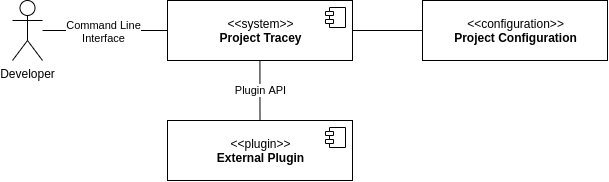

# System Scope and Context

## Developer

The developer is the main user of the software as part of the development process as well as the requirements process. The developer uses the software by using the command line interface.

## External Plugin

The system comes with a small set of default tools. It is possible to extend the system with custom plugins though. Plugins are hooked into the system by using the configuration and use the Plugin API to extend the base functionality of the system.
