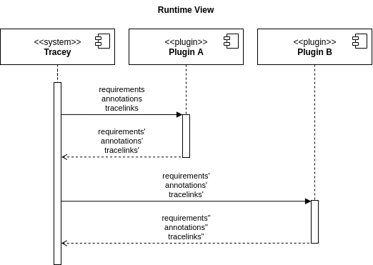

# Runtimte View

## Plugin API

Tracey can be configured to use a set of plugins. Plugins have to conform to the API. The plugin receives the current state of requirements, annotations and tracelinks as input and has to provide the same output parameters. The plugin can perform any processing, transformation or analysis. Tracey calls the plugins in order and sequentially.

