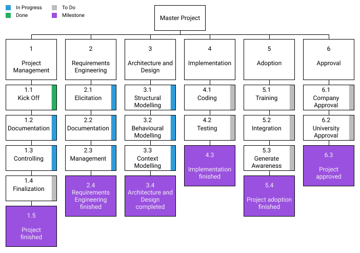
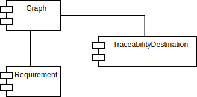
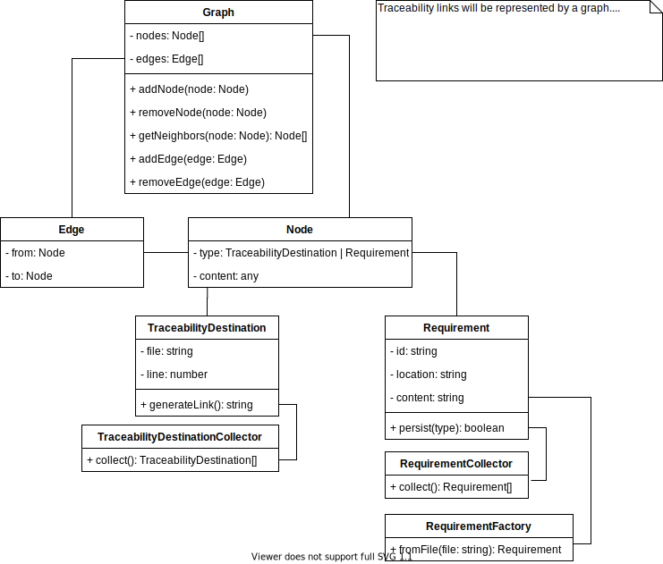

# Project Tracey

Traceability link auto-generation. An attempt to disentangle software complexity at the origin of change.

## Roles / Stakeholders
| Name              | Role                 |
|:------------------|:---------------------|
| Konstantin Hatvan | Student              |
| Klaus Feiler      | Technical Supervisor |
| Daniel Kienböck   | Academic Supervisor  |

Additionally, there will be other stakeholders involved during project development.
Developers as well as project managers will provide input and feedback.
The table will adapted accordingly whenever necessary.

## Project goals
| ID     | Description                                                                                                      |
|:------:|:-----------------------------------------------------------------------------------------------------------------|
| GOAL_1 | Enable the student to finish his masters degree. Overall project success                                         |
| GOAL_2 | Improve project documentation by generating additional value from structured requirements and traceability links |
| GOAL_3 | Improve conceptual quality by introducing a structured workflow for requirements engineering                     |
| GOAL_4 | Simplify impact analysis and therefore increase estimation quality by utilizing the new traceability information |

This list of goals is subject to change and will be adapted whenever necessary.

## Hypothesis
This project aims at improving several aspects of software quality by providing traceability links between structured requirements and source code artifacts.
I expect to improve
- project documentation
- conceptual quality
- impact analysis
- estimation quality

by providing additional incentive to create and maintain structured requirements.
The additional incentive is created by offering a useful tool for developers and project managers in various recurring tasks like effort estimation, project planning and change management.

Questions to be answered are:
- What value can be offered to developers and project managers from generating and maintaining traceability links?
- How can a new requirements engineering workflow be gradually introduced in a company?

## Requirements
| ID    | Description                                                                                                  |
|:-----:|:-------------------------------------------------------------------------------------------------------------|
| REQ_1 | Generate traceability links between requirements and source code artifacts                                   |
| REQ_2 | Allow incremental adoption of the software in existing as well as new projects                               |
| REQ_3 | Use markdown files for documenting the structured requirements                                               |
| REQ_4 | Use source code comments to document the links between the structured requirements and source code artifacts |

This list of requirements is subject to change and will be adapted whenever necessary.
Nevertheless, the general focus of the project shall remain as is.
Requirements elicitation, documentation and refinement is going to be a continuous effort.

## Work breakdown structure

## Architecture
The architecture documentation is still subject to change and will be adapted whenever necessary.
Architectural refinement and design refactoring is going to be a continuous effort throughout the development process.

### Component Diagram
The first analysis revealed three top level components.

### Class Diagram

## Kick-off date
June 22, 2020

## Milestones
| ID     | Description                           | Date             |
|:------:|---------------------------------------|------------------|
| MILE_1 | Minimum Viable Product is implemented | August 1, 2020   |
| MILE_2 | Project finalization                  | January 31, 2021 |

## Communication modalities / Meeting plan
The main communication channel with the academic supervisor is Microsoft Teams.
For communication regarding software specifics Github can also be used.
Every 4 weeks a meeting is scheduled between the student and the academic supervisor.  

For the technical supervisor, the company Slack will be used as main means of communication.
A dedicated Slack channel is used.
Meetings between the student and the technical supervisor are scheduled whenever necessary.
No fixed schedule is used.

## Project home/hosting
The project repository is hosted on [Github](https://github.com/konstantin-hatvan/traceability-tool/).
The repository is private.

## Source version control
Git is used for source version control.
The private repository is hosted on Github.

## Document management
Microsoft Team is primarily used to manage and share documents.
Github can be used whenever it is reasonable.

## Issue tracking
Issues from the academic supervisor are tracked in the Github project.
Issues from the technical supervisor are tracked in the company JIRA as well as the Github project.
The Github project acts as a single source of truth for project issues.

## Time tracking
In general, all time is tracked on the Github Issues.
If JIRA issues are provided by LimeSoda time is tracked on those JIRA issues as well as the Github issues.
The Github project acts as a single source of truth for time tracking.

## Risk analysis
| ID     | Description                                                                                                     | Priority | Actions                                                                                                                |
|:------:|:----------------------------------------------------------------------------------------------------------------|:--------:|:-----------------------------------------------------------------------------------------------------------------------|
| RISK_1 | Low user acceptance. Software is not used. Time was wasted                                                      | HIGH     | Utilize user-centered development approach. Make software incrementally adoptable                                      |
| RISK_2 | Ill-defined project boundaries. Stakeholders have secret expectations                                           | HIGH     | Clearly define project requirements and project boundaries. Communicate those boundaries to stakeholders               |
| RISK_3 | General solution can't be modelled. Custom solution for each programming language. Effort increases drastically | LOW      | Deeply understand the domain. Find reusable abstractions. Think of possible extensions. Adapt architecture accordingly |
| RISK_4 | Fragile project architecture. Software hard to maintain or extend. Software needs refactoring                   | MIDDLE   | Find a robust solution. Use a test driven development approach. Precisely document architectural decisions             |

This list of risks is subject to change and will be adapted whenever necessary.
